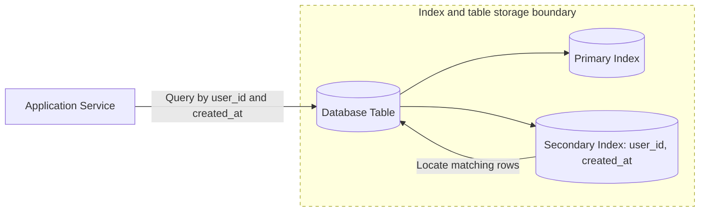

# Database Indexing and Query Patterns

**Database indexing and query patterns determine how efficiently a database can find, filter, sort, join, and return data for the access paths an application actually uses.**

## Summary

Indexes are auxiliary data structures that help databases locate rows or documents without scanning every record. Query patterns are the repeated ways an application reads and writes data, such as looking up a user by email, listing recent orders for an account, searching by status, or paginating a feed.

Good database design starts from access patterns. A table can be well normalized and still perform badly if common queries cannot use indexes. Likewise, too many indexes can slow writes, increase storage, and complicate maintenance. The goal is to create indexes that match important queries while avoiding unnecessary write amplification.

Read [Consistency Models](../distributed-systems/consistency-models.md) first if you're new to how replicas and stale reads affect query behavior.

Diagram legend used in this repository:
- Solid arrow: synchronous request/response
- Dashed arrow: asynchronous / eventual flow
- Cylinder shape: stateful storage
- Dotted boundary box: failure domain or scaling boundary

### Real-World Examples

PostgreSQL uses B-tree indexes by default for equality and range queries. MySQL/InnoDB clusters table data around the primary key. MongoDB relies heavily on indexes that match document query shapes, sort orders, and compound filters.

## Why It Matters

Database performance often depends less on the database brand and more on whether queries match the available indexes. A missing index can turn a fast lookup into a full table scan. At small scale this may be invisible; at large scale it can dominate latency, saturate CPU, and exhaust I/O.

Indexes also affect product behavior. A feed ordered by time needs different access support than an admin dashboard filtered by status. A search box needs different structures than a point lookup. Pagination, sorting, filtering, joins, and uniqueness checks all become design questions.

In interviews, indexing shows that you can connect API requirements to storage behavior. Instead of only naming a database, explain the expected read and write paths, the primary keys, secondary indexes, sort order, cardinality, and whether the system can tolerate stale indexed views.

## How It Works

An index stores selected columns or fields in a structure optimized for lookup. B-tree indexes are common for equality, range scans, ordering, and prefix access. Hash indexes can support fast equality lookups but are not generally useful for range queries. Specialized indexes such as inverted indexes, geospatial indexes, and full-text indexes serve search-specific patterns.

Primary keys identify records and often define physical or logical organization. Secondary indexes support alternate lookup paths such as `email`, `user_id`, `status`, or `(tenant_id, created_at)`. Compound indexes matter because column order affects whether the database can use the index for filtering and sorting.

Query patterns should drive index selection. If the application frequently asks for "latest orders for a user," an index on `(user_id, created_at)` is more useful than separate indexes on `user_id` and `created_at`. If the application filters by `tenant_id` everywhere, tenant should often be part of important compound indexes.

Indexes are not free. Every insert, update, and delete may need to update multiple index structures. Large indexes consume memory and disk. Low-cardinality fields, such as booleans, may not help much unless combined with more selective columns. Good teams inspect query plans, measure p95 latency, and remove unused indexes.

## Trade-Offs

| Choice A | Choice B |
| --- | --- |
| More indexes improve read paths for matching queries. | More indexes slow writes and increase storage cost. |
| Compound indexes can satisfy filters and sort order together. | Poor column order can make a compound index unusable for important queries. |
| Primary-key lookups are simple and fast. | Alternate access patterns require secondary indexes or denormalized views. |
| Offset pagination is easy to implement. | Cursor pagination is more stable and efficient for large or changing result sets. |
| Normalized schemas reduce duplication. | Denormalized read models can reduce joins but add consistency and update complexity. |

## Failure Modes

### Client-Side

- Clients may request arbitrary filters or sorts that no index can support.
- Offset pagination can skip or duplicate items while data changes.
- Large page sizes can cause slow queries and memory pressure.
- User-facing search may time out if treated like a simple database filter.

### Network

- Large result sets can increase response transfer time even when the query is indexed.
- Cross-region reads can hide whether latency comes from the database or the network.
- Connection pool saturation can make indexed queries appear slow.
- Repeated client retries can multiply expensive database work.

### Server-Side

- Application code may add filters that prevent index usage.
- N+1 query patterns can overwhelm the database with many small lookups.
- Missing query timeouts can let slow scans consume worker resources.
- Caching a bad query result can hide performance problems until cache invalidation.

### Data Layer

- Missing indexes can cause full table scans under production load.
- Too many indexes can slow writes and increase replication lag.
- Stale statistics can make the query planner choose poor execution plans.
- Locking or index rebuilds can affect availability during migrations.

## Interview Notes

Start with access patterns. For each API, ask which entity is read, how it is filtered, how it is sorted, and how many rows are expected. Then propose indexes that match those patterns. Mention primary keys, secondary indexes, compound index order, and pagination strategy.

Be careful with vague claims like "we will index everything." That improves nothing in a design discussion. Instead, say why a specific index exists and what query it serves. Also call out write cost, storage overhead, query-plan validation, and index migration risk for large tables.

Interviewer question: "Why can adding an index make writes slower?"
Model answer: Each write may need to update the table plus every affected index, so extra indexes increase disk, memory, locking, and replication work.

Interviewer question: "Why is cursor pagination usually better than offset pagination at scale?"
Model answer: Cursor pagination uses a stable indexed position, while offset pagination forces the database to skip growing numbers of rows and can behave inconsistently as data changes.

## Related Topics

- [Consistency Models](../distributed-systems/consistency-models.md)
- [CAP Theorem and PACELC](../distributed-systems/cap-theorem-pacelc.md)
- [Latency, Throughput, Availability, and Durability](../fundamentals/latency-throughput-availability-durability.md)
- [Code Snippets: Databases](../../code-snippets/databases/)
- [System Design Toolkit README](../../README.md)
