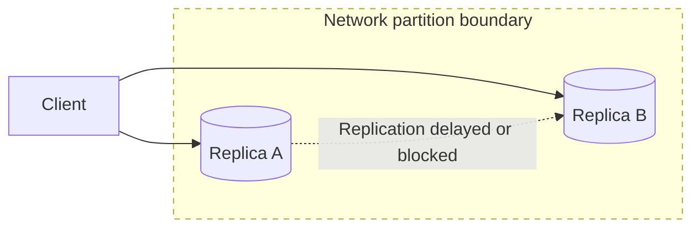

# CAP Theorem and PACELC

**CAP theorem and PACELC describe the trade-offs distributed data systems make between consistency, availability, partition tolerance, and latency.**

## Summary

CAP theorem says that when a network partition occurs, a distributed data system must choose between consistency and availability. Consistency means clients see a correct, up-to-date view of data. Availability means every request to a non-failing node receives a response. Partition tolerance means the system continues operating despite dropped, delayed, or split network communication between nodes.

PACELC extends CAP by pointing out that trade-offs exist even when there is no partition. If there is a partition, choose between availability and consistency; else choose between latency and consistency. This is often more useful in real design discussions because most systems spend more time in normal operation than in full network partitions.

Diagram legend used in this repository:
- Solid arrow: synchronous request/response
- Dashed arrow: asynchronous / eventual flow
- Cylinder shape: stateful storage
- Dotted boundary box: failure domain or scaling boundary

### Real-World Examples

Apache Cassandra favors availability and partition tolerance with tunable consistency. Traditional single-leader relational databases often favor consistency for writes. DynamoDB-style systems expose design choices around latency, availability, replication, and consistency levels.

## Why It Matters

CAP and PACELC help explain why distributed systems cannot optimize every desirable property at once. Once data is copied across machines, networks become part of correctness. If replicas cannot communicate, the system must decide whether to reject some operations or accept them and reconcile later.

This matters because different products need different behavior. A payment ledger should usually preserve consistency over availability for critical writes. A social media like counter may accept temporary inconsistency to remain available. A product catalog may tolerate slightly stale reads if that keeps pages fast and resilient.

PACELC is especially useful because it prevents a common mistake: treating CAP as only an outage topic. Even during normal operation, strong consistency often requires coordination between replicas, and coordination adds latency. Systems that avoid coordination can be faster, but they may return stale or conflicting data.

## How It Works

In a distributed data system, data is replicated across nodes for durability, availability, or read scalability. Under normal conditions, replicas communicate to keep state aligned. During a network partition, some nodes cannot exchange updates. At that point, a system has two broad choices.

A CP-style system preserves consistency during the partition. It may reject writes or reads that cannot be safely coordinated. Users may see errors, but the system avoids accepting conflicting updates. Many strongly consistent databases and coordination systems lean this way for operations that require correctness.

An AP-style system preserves availability during the partition. It continues accepting requests on reachable nodes, even if those nodes cannot coordinate with other replicas. This can keep the application responsive, but conflicts, stale reads, or reconciliation work may appear later.

PACELC adds the normal-operation trade-off. If there is no partition, a system can still choose lower latency by reading from nearby replicas or accepting writes locally, or stronger consistency by coordinating before responding. Some databases expose this choice directly through consistency levels such as quorum reads, quorum writes, or eventually consistent reads.

CAP does not mean "choose two forever" in a simplistic way. Partition tolerance is unavoidable for distributed systems because networks can fail. The real question is what the system does when communication breaks and how much coordination it uses when communication is healthy.

## Trade-Offs

| Choice A | Choice B |
| --- | --- |
| Consistency during partitions avoids conflicting or stale results. | Availability during partitions keeps the system responsive but may require reconciliation. |
| Strong reads give clients the latest confirmed data. | Eventually consistent reads reduce coordination and can lower latency. |
| Synchronous replication improves correctness before acknowledging writes. | Asynchronous replication improves latency but risks lag and stale reads. |
| Quorum coordination balances correctness and availability. | Quorum systems add operational complexity and can still fail under bad partition shapes. |
| Rejecting unsafe writes protects invariants. | Accepting writes during partial failure improves user experience but can violate invariants temporarily. |

## Failure Modes

### Client-Side

- Clients may assume a successful write is immediately visible everywhere.
- Retry behavior can create duplicate or conflicting writes during partitions.
- Users may observe stale reads if the client is routed to a lagging replica.
- Offline clients can submit updates that conflict with newer server state.

### Network

- Partitions can split replicas into groups that cannot coordinate.
- High latency can look like failure and trigger timeout-based decisions.
- Packet loss can delay replication and increase inconsistency windows.
- Cross-region links can make strong coordination too slow for user-facing paths.

### Server-Side

- Nodes may accept writes that later conflict with writes accepted elsewhere.
- Leader election can stall if nodes cannot form a quorum.
- Poor timeout tuning can cause unnecessary failovers or rejected requests.
- Conflict resolution logic can choose the wrong winner or lose intent.

### Data Layer

- Replica lag can make reads stale even without a full partition.
- Multi-object transactions can fail if coordination is unavailable.
- Last-write-wins policies can overwrite valid concurrent updates.
- Reconciliation jobs can fall behind and leave divergent state unresolved.

## Interview Notes

Use CAP carefully. Do not say a system "chooses CA" if it is distributed across an unreliable network; partition tolerance is not optional. Instead, explain whether the system favors consistency or availability when a partition happens, and whether it favors lower latency or stronger consistency during normal operation.

Map the choice to the product. Payments, inventory deduction, account balances, and permissions usually need stronger consistency. Feeds, counters, recommendations, analytics, and presence can often tolerate eventual consistency. Mention techniques such as quorum reads and writes, leader-based replication, conflict resolution, idempotency, and reconciliation.

Interviewer question: "What does CAP force you to choose during a partition?"
Model answer: During a partition, a distributed data system must choose whether to preserve consistency by rejecting unsafe operations or preserve availability by responding despite possible stale or conflicting state.

Interviewer question: "Why is PACELC more practical than CAP alone?"
Model answer: PACELC also covers normal operation, where systems still trade stronger consistency against lower latency even when there is no network partition.

## Related Topics

- [Latency, Throughput, Availability, and Durability](../fundamentals/latency-throughput-availability-durability.md)
- [Stateless vs Stateful Services](../fundamentals/stateless-vs-stateful-services.md)
- [Vertical vs Horizontal Scaling](../scalability/vertical-vs-horizontal-scaling.md)
- [Code Snippets: Databases](../../code-snippets/databases/)
- [System Design Toolkit README](../../README.md)
