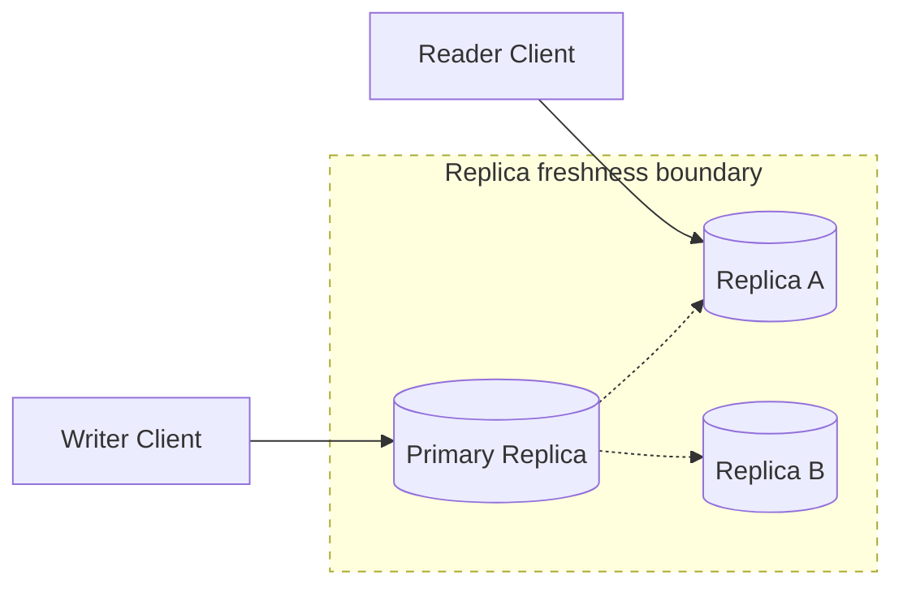

# Consistency Models

**Consistency models define what guarantees a system gives about the visibility, ordering, and freshness of reads and writes across clients and replicas.**

## Summary

A consistency model tells application developers what they can assume after data changes. If one client writes a value and another client reads soon after, does the reader always see the new value, sometimes see an older value, or see values in a particular order? The answer depends on the consistency model.

Distributed systems often replicate data for availability, durability, and low-latency reads. Once data exists on multiple machines, replicas can temporarily disagree. Stronger consistency models reduce surprise but usually require coordination. Weaker consistency models reduce coordination and latency but push more responsibility to the application or user experience.

Diagram legend used in this repository:
- Solid arrow: synchronous request/response
- Dashed arrow: asynchronous / eventual flow
- Cylinder shape: stateful storage
- Dotted boundary box: failure domain or scaling boundary

### Real-World Examples

Amazon DynamoDB offers eventually consistent and strongly consistent read options for some access patterns. Cassandra exposes tunable consistency levels such as one, quorum, and all. PostgreSQL primary-replica deployments often provide strong reads from the primary and potentially stale reads from replicas.

## Why It Matters

Consistency affects correctness, latency, availability, and user trust. A banking balance, inventory deduction, or permission change often needs stronger guarantees. A like count, timeline ranking, analytics dashboard, or recommendation list may tolerate temporary staleness.

The model also shapes failure behavior. Strong consistency often requires contacting a leader or quorum before responding, which can increase latency or reject requests during failures. Eventual consistency can keep the system responsive, but clients may observe stale data, out-of-order updates, or temporary conflicts.

In interviews, consistency models help justify database choices, replication strategy, cache behavior, and API semantics. A strong answer names the guarantee needed for each part of the system instead of claiming the entire system has one consistency level.

## How It Works

Strong consistency usually means reads reflect the most recent committed write according to a single global order. Linearizability is a common strong model: once a write completes, later reads should see it. This is valuable for locks, account balances, inventory, permissions, and other correctness-sensitive state.

Sequential consistency guarantees that all clients observe operations in the same order, but that order may not match real time. Causal consistency preserves cause-and-effect relationships: if update B depends on update A, clients should not see B without A. This is useful for conversations, comments, and collaborative flows where order matters.

Read-your-writes consistency guarantees that a client sees its own completed writes. Monotonic reads guarantee that once a client has seen a newer value, it will not later see an older one. These session guarantees are often enough to make user experiences feel correct without requiring global coordination for every read.

Eventual consistency means replicas converge if no new updates occur. Reads may be stale for a while, and concurrent writes may require conflict resolution. This model can improve latency and availability because reads and writes can often proceed with less coordination.

Many systems mix models. A service may write to a primary database for strong correctness, read from replicas for scalable browsing, cache public data with short TTLs, and use eventual consistency for counters or feeds.

## Trade-Offs

| Choice A | Choice B |
| --- | --- |
| Strong consistency gives simpler correctness guarantees. | Eventual consistency can improve latency, availability, and regional performance. |
| Reading from a primary reduces stale reads. | Reading from replicas improves scale but may expose replication lag. |
| Quorum reads and writes balance freshness and availability. | Quorum coordination increases latency and operational complexity. |
| Session guarantees improve user experience without global coordination. | Global guarantees are easier to reason about but more expensive to provide. |
| Conflict rejection protects invariants. | Conflict acceptance keeps writes available but requires reconciliation. |

## Failure Modes

### Client-Side

- Clients may assume a write is globally visible immediately after success.
- Users may see older data after refreshing if requests hit different replicas.
- Offline clients may submit conflicting updates after reconnecting.
- Retry logic may create duplicate writes if operations are not idempotent.

### Network

- Replication delays can make nearby replicas stale.
- Network partitions can prevent replicas from agreeing on write order.
- Cross-region coordination can add high and variable latency.
- Timeout settings can make slow coordination look like failed writes.

### Server-Side

- Leaders can become bottlenecks for strongly consistent writes.
- Failover can expose stale replicas if promotion rules are unsafe.
- Conflict resolution can overwrite meaningful concurrent updates.
- Mixed consistency paths can surprise developers if guarantees are undocumented.

### Data Layer

- Replica lag can violate read-after-write expectations.
- Cache entries can remain stale after the source of truth changes.
- Multi-record invariants can break when updates are eventually reconciled.
- Clock skew can corrupt last-write-wins conflict resolution.

## Interview Notes

Do not choose one consistency model for the whole system by default. Split by data type and user expectation. Payments, inventory, permissions, and account state usually need strong consistency or carefully scoped transactions. Feeds, counters, search indexes, notifications, and analytics can often tolerate eventual consistency.

Use precise terms. Say "read-your-writes" if a user must see their own profile update immediately. Say "eventual consistency" if replicas or indexes can lag. Say "linearizable writes" when correctness depends on one confirmed order. Also mention how the system handles stale reads, retries, conflict resolution, cache invalidation, and replica lag.

Interviewer question: "Is eventual consistency the same as incorrect data?"
Model answer: No, eventual consistency is a defined guarantee that replicas converge over time, but the application must tolerate temporary staleness or conflicts.

Interviewer question: "Where would you require strong consistency in an e-commerce system?"
Model answer: Inventory reservation, payment state, and order creation usually need strong guarantees because stale or conflicting writes can oversell items or corrupt financial records.

## Related Topics

- [CAP Theorem and PACELC](cap-theorem-pacelc.md)
- [Latency, Throughput, Availability, and Durability](../fundamentals/latency-throughput-availability-durability.md)
- [Stateless vs Stateful Services](../fundamentals/stateless-vs-stateful-services.md)
- [Code Snippets: Databases](../../code-snippets/databases/)
- [System Design Toolkit README](../../README.md)
