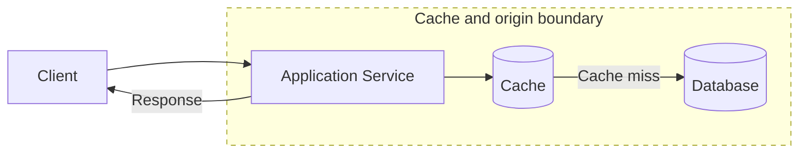

# Caching Strategies

**Caching strategies define how a system stores and refreshes frequently used data in faster storage to reduce latency, backend load, and repeated computation.**

## Summary

Caching keeps copies of data closer to where they are used. A cache may live in a browser, CDN, reverse proxy, application process, distributed in-memory store, database buffer pool, or search layer. The core idea is simple: if the same data is requested repeatedly, serving it from a faster location can improve response time and protect slower systems.

The hard part is correctness. Cached data can become stale, invalidation can be missed, and cache failures can shift sudden load back to databases or services. A good caching strategy defines what is cached, where it is cached, how long it lives, how it is invalidated, and what happens when the cache is unavailable.

Read [Database Indexing and Query Patterns](../databases/database-indexing-query-patterns.md) first if you're new to how query shape affects backend load.

Diagram legend used in this repository:
- Solid arrow: synchronous request/response
- Dashed arrow: asynchronous / eventual flow
- Cylinder shape: stateful storage
- Dotted boundary box: failure domain or scaling boundary

### Real-World Examples

Cloudflare caches static assets and edge responses close to users. Redis is commonly used as a distributed application cache for sessions, rate limits, and hot objects. YouTube and Netflix rely heavily on layered caching and CDN delivery to reduce origin traffic.

## Why It Matters

Caching is one of the most common ways to improve read latency and reduce load on databases, APIs, and expensive computations. Without caching, repeated requests for the same data may force the system to recompute or refetch identical results again and again.

Caching also changes capacity planning. A high cache hit rate can let a database survive large read traffic. A sudden drop in hit rate can overload the origin. This makes cache behavior part of reliability planning, not just performance tuning.

In interviews, caching is a practical lever. It helps with feeds, profiles, product pages, search results, media metadata, configuration, authentication data, and rate limiting. A strong answer explains the cache key, value, TTL, invalidation path, consistency expectation, and fallback behavior.

## How It Works

A cache stores data by key. On a cache hit, the system returns the cached value. On a cache miss, it fetches from the source of truth, stores the result if appropriate, and returns the value. Common cache policies include time-to-live expiration, least recently used eviction, explicit invalidation, and write-triggered updates.

Cache-aside is a common pattern where application code checks the cache first, loads from the database on miss, and writes the result back to the cache. Read-through caches hide that loading behavior behind the cache interface. Write-through caches update the cache and backing store together. Write-behind caches acknowledge writes quickly and persist them later, trading durability risk for write latency.

Caching can happen at multiple layers. Browser caches reduce repeated asset downloads. CDNs reduce global latency and origin traffic. Reverse proxies cache HTTP responses. Application caches store computed objects. Distributed caches share hot data across a fleet. Database caches keep frequently accessed pages in memory.

The most important design detail is freshness. Some data can be cached for minutes or hours. Other data needs short TTLs, versioned keys, event-based invalidation, or no caching at all. The right answer depends on how harmful stale data is.

## Trade-Offs

| Choice A | Choice B |
| --- | --- |
| Longer TTLs improve hit rate and reduce backend load. | Longer TTLs increase the chance of stale data. |
| Cache-aside is simple and flexible for application teams. | Cache-aside can create duplicate loading logic and race conditions. |
| Write-through keeps cache and storage aligned during writes. | Write-through adds write latency and couples cache health to write paths. |
| Write-behind improves write latency and absorbs bursts. | Write-behind risks data loss or reordering if the cache fails before persistence. |
| Distributed caches share hot data across servers. | Distributed caches add network hops, serialization cost, and operational complexity. |

## Failure Modes

### Client-Side

- Browser or mobile caches may serve stale assets after deployment.
- Clients may cache private responses incorrectly.
- Aggressive client retries can amplify origin load during cache misses.
- Cached authorization or profile state can confuse users after account changes.

### Network

- Cache nodes can become unreachable even when the database is healthy.
- Cross-region cache access can add latency instead of reducing it.
- CDN routing issues can affect only some geographic users.
- Packet loss can increase cache timeout rates and trigger origin fallbacks.

### Server-Side

- Cache stampedes can occur when many requests miss for the same hot key.
- Bad cache keys can mix data between tenants or users.
- Missing invalidation can keep stale values visible after writes.
- Treating cache failure as fatal can reduce availability unnecessarily.

### Data Layer

- Database overload can occur after a cache outage or large invalidation.
- Replica lag can populate caches with stale values.
- Eviction of hot keys can cause sudden backend spikes.
- Write-behind caches can lose acknowledged writes before persistence.

## Interview Notes

Start by identifying whether the workload is read-heavy, whether data is expensive to compute, and how stale the response is allowed to be. Then choose the cache layer: CDN for static or public edge data, application or distributed cache for hot objects, and database-level caching for storage internals.

Always mention cache keys, TTLs, invalidation, eviction, fallback, and stampede protection. Useful techniques include request coalescing, jittered TTLs, negative caching, versioned keys, background refresh, and rate limiting origin fallback during incidents.

Interviewer question: "What is the hardest problem in caching?"
Model answer: Cache invalidation is usually hardest because the system must decide exactly when cached data is no longer safe to serve without overloading the source of truth.

Interviewer question: "How do you prevent a cache stampede?"
Model answer: Use request coalescing or locks for hot keys, add TTL jitter, refresh values in the background, and limit how many requests can fall through to the origin.

## Related Topics

- [Database Indexing and Query Patterns](../databases/database-indexing-query-patterns.md)
- [Latency, Throughput, Availability, and Durability](latency-throughput-availability-durability.md)
- [DNS, CDNs, Proxies, and Load Balancers](../networking/dns-cdns-proxies-load-balancers.md)
- [Code Snippets: Caching](../../code-snippets/caching/)
- [System Design Toolkit README](../../README.md)
