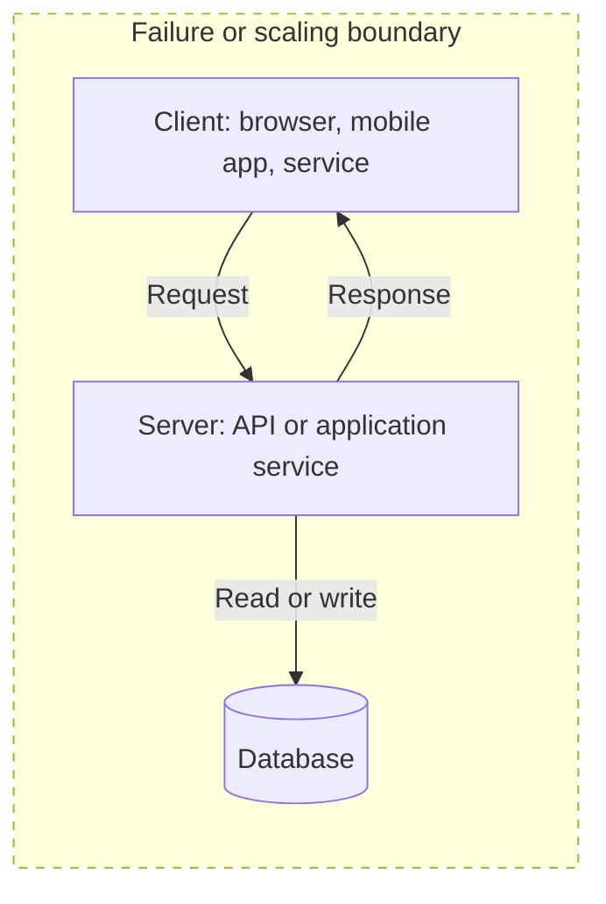
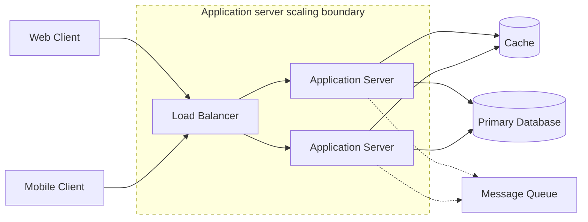

# Client-Server Architecture

**Client-server architecture is a system model where client programs initiate requests and server programs provide shared services, data, or computation in response.**

## Summary

Client-server architecture is the baseline pattern behind most web applications, mobile apps, APIs, databases, and service-to-service systems. A client is the requester: it might be a browser, mobile app, CLI, IoT device, or another backend service. A server is the responder: it owns shared logic, data access, authorization, processing, coordination, or integration with other systems.

The model is simple, but it scales into more advanced architectures. A single client calling a single server can evolve into many clients calling a load-balanced fleet of stateless application servers backed by caches, queues, databases, replicas, and monitoring systems.

Diagram legend used in this repository:
- Solid arrow: synchronous request/response
- Dashed arrow: asynchronous / eventual flow
- Cylinder shape: stateful storage
- Dotted boundary box: failure domain or scaling boundary

### Real-World Examples

Netflix clients request catalogs, playback metadata, recommendations, and account data from backend services. Amazon retail clients call server-side services for search, cart, checkout, payment, and order tracking. Slack desktop, web, and mobile clients communicate with servers for messages, presence, file uploads, and notifications.

## Why It Matters

Client-server architecture matters because it creates a clear separation of responsibilities. Clients focus on user interaction, local state, rendering, and request initiation. Servers centralize shared business rules, data access, authorization, coordination, and operational controls.

This separation helps teams evolve systems safely. Server-side logic can often be deployed without updating every client. Multiple clients can reuse the same backend capabilities. Security controls can be enforced consistently at the server. Operational concerns such as logging, monitoring, rate limiting, and access control can be handled close to the protected data.

In interviews, this model is usually the first version of the design. From there, the interviewer expects you to evolve it based on requirements: add load balancing for availability, caching for low-latency reads, queues for asynchronous work, replication for durability, and observability for production debugging.

## How It Works

A typical client-server flow starts when the client creates a request using a protocol such as HTTP, WebSocket, gRPC, TCP, or a database-specific protocol. The request travels across the network to a server address, often discovered through DNS and reached through a proxy, gateway, or load balancer.

The server receives the request, validates input, authenticates the caller if needed, checks authorization, applies business logic, and reads or writes state. That state may live in a relational database, NoSQL database, cache, object store, search index, or another service. The server then returns a response containing data, status, or an error.

At small scale, one server may handle all traffic. At larger scale, systems usually split responsibilities. A load balancer distributes requests across several stateless application servers. A cache absorbs repeated reads. A database stores durable state. A message queue moves slow or retryable work out of the synchronous request path.

## Trade-Offs

| Choice A | Choice B |
| --- | --- |
| Thin clients are easier to update and keep business rules centralized. | Rich clients can reduce server work, support offline behavior, and improve perceived latency. |
| Centralized server logic improves governance, security, and consistency. | Centralization can create bottlenecks and larger blast radius during server incidents. |
| Synchronous request-response flows are simple to reason about. | Asynchronous flows improve resilience for slow work but add queues, retries, and eventual consistency. |
| Shared backend APIs reduce duplication across clients. | Client-specific APIs can improve performance but increase backend surface area. |
| Stateful servers can keep local session context nearby. | Stateless servers are easier to load balance, replace, and scale horizontally. |

## Failure Modes

### Client-Side

- Clients may retry too aggressively and amplify an outage.
- Old client versions may call removed or incompatible server APIs.
- Poor local timeout handling can make the application feel frozen.
- Offline clients may submit stale or conflicting state after reconnecting.

### Network

- DNS failures can prevent clients from finding servers.
- Packet loss, high latency, or network partitions can cause timeouts.
- TLS or certificate misconfiguration can block otherwise healthy services.
- Mobile networks can create intermittent connectivity and duplicate requests.

### Server-Side

- A single server can become a bottleneck or single point of failure.
- Thread pools, connection pools, memory, or CPU can be exhausted under load.
- Deployments can introduce incompatible behavior or temporary unavailability.
- Missing rate limits can allow a small number of clients to overload the service.

### Data Layer

- Database failures can surface as server errors.
- Slow queries can increase server latency and exhaust request workers.
- Connection pool exhaustion can block otherwise healthy application servers.
- Inconsistent reads can confuse clients if replication lag is not expected.

## Interview Notes

Start with the simplest client-server design, then add complexity only when the requirements justify it. Name the clients, protocol, server responsibilities, and stateful systems early. Then explain how the design changes as traffic grows or reliability requirements become stricter.

Strong talking points include using stateless application servers for horizontal scaling, load balancers for distribution and availability, caches for repeated reads, queues for slow work, and timeouts, retries, idempotency, rate limiting, logs, metrics, and traces for production behavior.

Interviewer question: "Why not let the client talk directly to the database?"
Model answer: Direct database access exposes sensitive credentials and schema details, bypasses centralized authorization, and makes it harder to evolve business logic safely.

Interviewer question: "When would you move work out of the request-response path?"
Model answer: Move work asynchronously when it is slow, retryable, not required for the immediate user response, or likely to reduce availability if performed inline.

## Related Topics

- [System Design Toolkit README](../../README.md)
