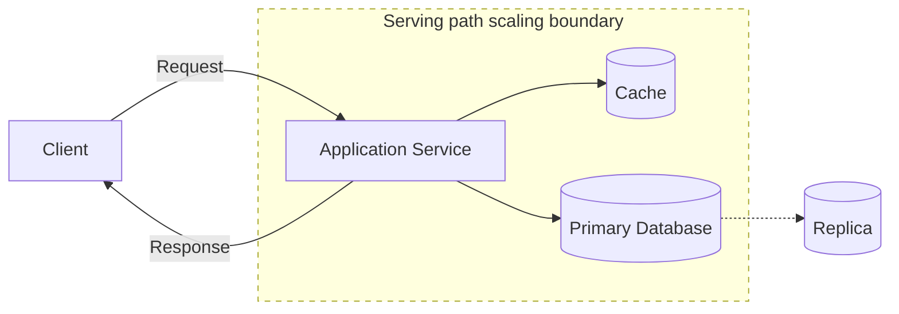

# Latency, Throughput, Availability, and Durability

**Latency, throughput, availability, and durability are core system qualities that describe how fast, how much, how often, and how safely a system serves work and preserves data.**

## Summary

Latency measures how long one operation takes. Throughput measures how many operations a system can handle over time. Availability measures whether the system is able to serve requests when needed. Durability measures whether committed data survives failures.

These four qualities often pull against each other. A system can increase throughput with batching but increase latency. It can improve availability with replicas but introduce consistency challenges. It can improve durability with synchronous replication but slow writes. Strong system design means naming the target for each quality and explaining the trade-offs.

Diagram legend used in this repository:
- Solid arrow: synchronous request/response
- Dashed arrow: asynchronous / eventual flow
- Cylinder shape: stateful storage
- Dotted boundary box: failure domain or scaling boundary

### Real-World Examples

Google Search optimizes for very low perceived latency at enormous throughput. Stripe designs payment APIs around high availability and durable transaction records. Amazon S3 emphasizes durability so stored objects survive hardware and facility failures.

## Why It Matters

These qualities turn vague requirements into engineering constraints. "Fast" usually means a latency target such as p95 under 200 ms. "Can handle scale" usually means a throughput target such as 50,000 reads per second. "Reliable" may mean 99.9% or 99.99% availability. "Do not lose data" means durability requirements that influence storage, replication, backups, and write acknowledgements.

They also help avoid overbuilding. A social feed can often tolerate eventual consistency but needs high read throughput. A payment ledger needs durable writes and strong correctness, even if latency is slightly higher. A live cursor in a collaborative editor needs low latency but may not require the same durability as the final document state.

In interviews, these terms are a bridge from requirements to architecture. They justify caches, queues, replication, database choices, region strategy, retry behavior, and observability.

## How It Works

Latency is measured per operation. Common views include average, median, p95, p99, and maximum latency. Tail latency matters because users and dependent services experience the slow requests, not just the average. Latency includes client processing, DNS, connection setup, network travel, queueing, server work, database calls, serialization, and response transfer.

Throughput is measured as work per unit time, such as requests per second, messages per second, writes per second, or bytes per second. A system can have high throughput and still feel slow if requests wait in queues. Throughput usually improves through parallelism, batching, caching, partitioning, and removing bottlenecks.

Availability is the fraction of time a system can perform its required function. It depends on redundancy, failover, health checks, deployment safety, dependency health, and graceful degradation. Availability should be scoped: an API may be available for reads while writes are degraded.

Durability is the probability that stored data will not be lost after it is acknowledged. It depends on write-ahead logs, replication, checksums, backups, object storage design, disk behavior, and recovery procedures. Durability is not the same as availability: data can be safe but temporarily inaccessible, or accessible but not safely persisted.

A practical design defines service-level objectives for each quality, then chooses mechanisms that support them: caches for latency, horizontal scaling for throughput, replicas for availability, and replicated storage plus backups for durability.

## Trade-Offs

| Choice A | Choice B |
| --- | --- |
| Batching improves throughput by processing more work per operation. | Batching can increase latency because individual requests wait for a batch. |
| Synchronous replication improves durability before acknowledging writes. | Synchronous replication increases write latency and can reduce availability during replica failures. |
| Caching reduces read latency and backend load. | Caching can serve stale data and requires invalidation strategy. |
| Aggressive retries can improve apparent availability for transient failures. | Retries can amplify overload and increase tail latency. |
| Multi-region deployment improves availability during regional outages. | Multi-region systems add cost, operational complexity, and consistency challenges. |

## Failure Modes

### Client-Side

- Clients may measure only average latency and miss poor p95 or p99 behavior.
- Retry storms can overload servers and reduce availability further.
- Long client timeouts can keep users waiting after the server is already unhealthy.
- Poor offline handling can make durable server state look missing or inconsistent.

### Network

- DNS, TLS, proxy, or load-balancer delays can dominate end-to-end latency.
- Packet loss and congestion can reduce throughput even when servers have capacity.
- Regional network failures can make a healthy service unavailable to some users.
- Cross-region calls can add unpredictable latency to critical paths.

### Server-Side

- Thread pools, CPU, memory, or connection pools can saturate and create queueing delays.
- Slow deployments or bad rollbacks can reduce availability.
- Shared dependencies can become hidden bottlenecks that cap throughput.
- Missing backpressure can let incoming traffic exceed processing capacity.

### Data Layer

- Slow queries can increase tail latency across the entire request path.
- Single-primary databases can limit write throughput.
- Replica lag can make available reads return stale data.
- Weak backup or restore procedures can turn a storage failure into permanent data loss.

## Interview Notes

Quantify these qualities early. Instead of saying "low latency," state an assumption like "p95 read latency under 200 ms." Instead of saying "high availability," ask whether the target is 99.9%, 99.99%, or higher, and whether the requirement applies to reads, writes, or both.

Tie each quality to a design decision. Caches and CDNs reduce latency. Partitioning and horizontal scaling improve throughput. Load balancers, health checks, replicas, and graceful degradation improve availability. Replication, write-ahead logs, object storage, and tested backups improve durability.

Interviewer question: "Can a system be durable but unavailable?"
Model answer: Yes, data can be safely stored on replicated disks or backups while the service is temporarily unable to serve it because compute, networking, or routing is down.

Interviewer question: "Why is p99 latency often more important than average latency?"
Model answer: Average latency hides the slowest requests, while p99 exposes tail behavior that users, retries, and dependent services often experience during load or partial failure.

## Related Topics

- [Client-Server Architecture](client-server-architecture.md)
- [HTTP, REST, WebSockets, and gRPC](../networking/http-rest-websockets-grpc.md)
- [DNS, CDNs, Proxies, and Load Balancers](../networking/dns-cdns-proxies-load-balancers.md)
- [System Design Toolkit README](../../README.md)
