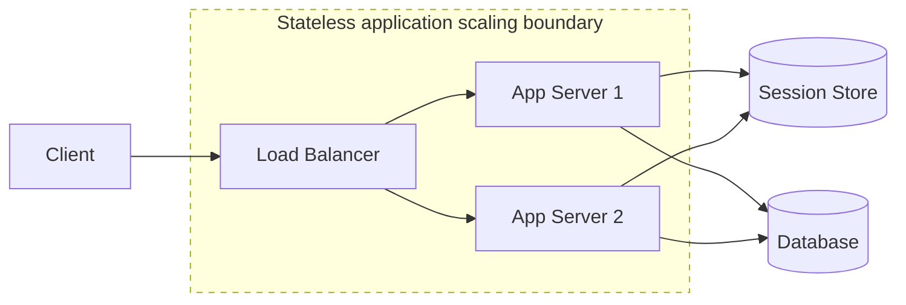
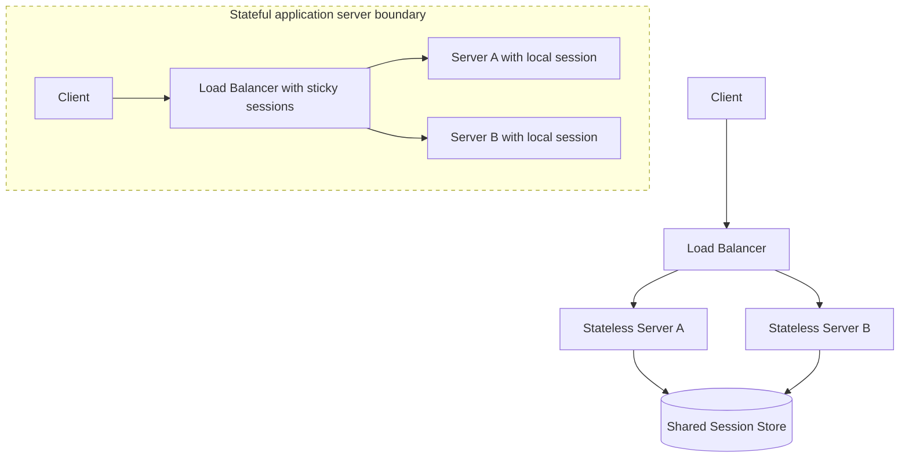

# Stateless vs Stateful Services

**A stateless service does not rely on local memory from previous requests, while a stateful service keeps durable or session-specific information that affects future behavior.**

## Summary

Stateless and stateful services differ in where they keep the information needed to process requests. A stateless service can handle each request independently because required context comes from the request itself or from external storage. A stateful service keeps important context in memory, on local disk, or in a tightly coupled storage layer.

Most scalable web application tiers aim to be stateless because stateless servers are easier to load balance, replace, autoscale, and deploy. Stateful systems are still essential: databases, caches, queues, coordination systems, file stores, and real-time session managers all maintain state. The design question is not whether state exists, but where it lives and how safely it is managed.

Diagram legend used in this repository:
- Solid arrow: synchronous request/response
- Dashed arrow: asynchronous / eventual flow
- Cylinder shape: stateful storage
- Dotted boundary box: failure domain or scaling boundary

### Real-World Examples

Most REST API fleets at companies such as Stripe, GitHub, and Shopify are designed so any healthy application server can handle a request. Redis and PostgreSQL are stateful systems because they preserve data across operations. Multiplayer games and collaborative editing tools often use stateful connection managers for low-latency shared session state.

## Why It Matters

State placement directly affects scalability and reliability. If application servers are stateless, a load balancer can route any request to any server. Failed servers can be removed without losing user sessions. New servers can be added quickly during traffic spikes. Deployments are simpler because instances can be drained and replaced.

Stateful services are harder to move because they own information that must survive failures or remain close to the process using it. A database cannot usually be replaced as casually as a stateless application server. A WebSocket server tracking active connections needs careful draining. A cache node losing memory may create a surge of misses against the database.

In interviews, this topic comes up whenever you discuss scaling, sessions, load balancing, caching, databases, real-time systems, or failover. A strong answer names which tier is stateless, which tier is stateful, and what happens if a node disappears.

## How It Works

A stateless service receives all required request context from the request, token, headers, or external stores. For example, an API server may validate a JWT, fetch user data from a database, read cached configuration, execute business logic, and return a response. The server does not need the same client to return to the same machine later.

A stateful service keeps information between operations. This state may be durable, like database rows on disk, or temporary, like in-memory sessions, locks, connection metadata, cache entries, or stream offsets. Stateful services often need replication, backups, leader election, partitioning, or recovery mechanisms.

Session handling is a common example. In a stateful application-server design, session data lives in server memory, so the load balancer may need sticky sessions. In a stateless application-server design, session data lives in an external store or signed token, so any server can process the request. This improves horizontal scaling but adds dependency on the external session mechanism.

## Trade-Offs

| Choice A | Choice B |
| --- | --- |
| Stateless application servers are easy to scale, replace, and load balance. | Stateful application servers can keep hot context nearby and reduce external lookups. |
| External session stores allow any server to handle any request. | External stores add network calls and become dependencies that must be scaled. |
| Sticky sessions preserve local state with less application change. | Sticky sessions reduce load-balancing flexibility and complicate failover. |
| Signed client-side tokens reduce server-side session storage. | Tokens can become large, hard to revoke, or risky if secrets are mishandled. |
| Stateful storage systems provide durable shared truth. | Stateful systems require backup, replication, recovery, and careful operations. |

## Failure Modes

### Client-Side

- Clients may assume a session still exists after the server holding it has failed.
- Large tokens can increase request size and latency.
- Offline clients may replay stale state after reconnecting.
- Reconnect behavior can overload stateful connection managers.

### Network

- Network partitions can separate stateless servers from required external state stores.
- Sticky-session routing can break if proxy or load-balancer state is lost.
- Cross-region state access can add latency to otherwise stateless request paths.
- Connection drops can remove stateful real-time sessions unexpectedly.

### Server-Side

- Local in-memory state disappears when an instance crashes or is redeployed.
- Stateful servers are harder to autoscale because new nodes start without local context.
- Poor connection draining can disconnect active users during deployment.
- Missing idempotency can make retries corrupt state after partial failures.

### Data Layer

- External session stores can become bottlenecks or single points of failure.
- Cache state can be lost during eviction or node restart.
- Replication lag can cause different servers to observe different state.
- Backup gaps can turn stateful service failures into permanent data loss.

## Interview Notes

Use statelessness as a scaling tool, not as a claim that the whole system has no state. State always exists somewhere. The key is to move durable and shared state into systems designed to manage it, then keep application workers replaceable.

Mention the consequences. Stateless application servers work well behind load balancers and autoscaling groups. Stateful databases, queues, and caches need replication, monitoring, backups, and recovery plans. For real-time connections, call out sticky routing, connection draining, heartbeats, and reconnection.

Interviewer question: "If a service uses a database, is the service stateful?"
Model answer: The application server can still be stateless if it does not depend on local request history; the database is the stateful component that owns durable state.

Interviewer question: "Why are sticky sessions often avoided?"
Model answer: Sticky sessions make load balancing and failover harder because users depend on a specific server, so losing that server can lose local session context.

## Related Topics

- [Client-Server Architecture](client-server-architecture.md)
- [Latency, Throughput, Availability, and Durability](latency-throughput-availability-durability.md)
- [Vertical vs Horizontal Scaling](../scalability/vertical-vs-horizontal-scaling.md)
- [DNS, CDNs, Proxies, and Load Balancers](../networking/dns-cdns-proxies-load-balancers.md)
- [System Design Toolkit README](../../README.md)
