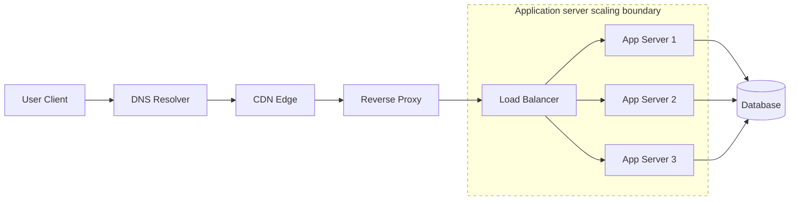

# DNS, CDNs, Proxies, and Load Balancers

**DNS, CDNs, proxies, and load balancers are traffic-routing layers that help users find services, reduce latency, protect backends, and distribute requests across healthy servers.**

## Summary

A client rarely connects directly to one application server in a production system. The request usually passes through several routing and acceleration layers first. DNS translates a human-readable name into network addresses. A CDN serves cacheable content from locations close to users. Proxies sit between clients and services to route, secure, observe, or transform traffic. Load balancers distribute requests across backend servers.

Together, these components form the front door of many systems. They improve performance and availability, but they also introduce configuration, caching, routing, and failure-mode complexity.

Diagram legend used in this repository:
- Solid arrow: synchronous request/response
- Dashed arrow: asynchronous / eventual flow
- Cylinder shape: stateful storage
- Dotted boundary box: failure domain or scaling boundary

### Real-World Examples

Cloudflare and Akamai operate global CDN and edge proxy networks for websites and APIs. Netflix uses CDN infrastructure to deliver video close to viewers. AWS Elastic Load Balancing and Google Cloud Load Balancing distribute traffic across backend compute fleets.

## Why It Matters

These layers decide how traffic reaches a system. A good design can reduce latency, absorb spikes, protect application servers, route around failures, and make deployments safer. A poor design can create stale content, uneven load, confusing outages, or hidden single points of failure.

DNS matters because it is often the first dependency in request routing. CDN behavior matters because cache hits can prevent requests from reaching origin at all. Proxies matter because they often terminate TLS, enforce routing rules, add headers, authenticate requests, or centralize observability. Load balancers matter because backend servers fail, deploy, scale up, and scale down continuously.

In interviews, these components show that you understand the path between the user and the application. They are especially important for global systems, high-read systems, static assets, API platforms, video delivery, and services that need high availability.

## How It Works

DNS maps names such as `api.example.com` to IP addresses or other DNS records. Clients usually ask a recursive resolver, which may use cached records until their TTL expires. DNS can support simple failover and geographic routing, but changes are not instant because caches exist at many layers.

A CDN stores cacheable content at edge locations near users. Static assets, images, videos, JavaScript bundles, and public API responses may be served from the edge. If the CDN has a cache hit, the origin server is not contacted. If it has a miss, the CDN fetches from origin, may cache the response, and returns it to the client.

A proxy is an intermediary. A forward proxy acts on behalf of clients. A reverse proxy acts on behalf of servers. Reverse proxies commonly terminate TLS, route by host or path, apply compression, enforce request limits, add security headers, and forward traffic to services.

A load balancer distributes requests across a pool of backend servers. It uses health checks to avoid unhealthy targets and algorithms such as round-robin, least connections, weighted routing, or consistent hashing. Layer 4 load balancers operate at the transport layer, while Layer 7 load balancers understand HTTP-level details such as paths, headers, and cookies.

These layers often work together: DNS routes users to a nearby edge, the CDN serves cacheable data, a reverse proxy handles HTTP concerns, and a load balancer spreads dynamic requests across application servers.

## Trade-Offs

| Choice A | Choice B |
| --- | --- |
| Low DNS TTL allows faster failover and routing changes. | High DNS TTL reduces resolver load and improves cache efficiency. |
| CDN caching reduces latency and origin traffic. | Cached content can become stale or require explicit invalidation. |
| Layer 4 load balancing is fast and protocol-agnostic. | Layer 7 load balancing enables smarter routing but adds processing overhead. |
| Reverse proxies centralize TLS, routing, and security policy. | Proxy misconfiguration can break many services at once. |
| Sticky sessions keep a user on the same backend. | Stateless routing improves load distribution and server replaceability. |

## Failure Modes

### Client-Side

- Clients may cache DNS records longer than expected.
- Browser caches may serve stale assets after deployment.
- Clients may retry through the same failing edge or proxy path.
- Misconfigured client timeouts can hide whether DNS, CDN, proxy, or backend is slow.

### Network

- DNS resolver failures can prevent users from reaching healthy services.
- Regional network issues can make one edge location unreliable.
- TLS handshake failures can occur at CDN or proxy layers.
- Routing loops or bad upstream configuration can cause repeated redirects or gateway errors.

### Server-Side

- A load balancer can route to unhealthy servers if health checks are weak.
- A reverse proxy can become a bottleneck if connection limits are too low.
- Uneven load-balancing algorithms can overload a subset of servers.
- Bad rollout configuration can send production traffic to incompatible backend versions.

### Data Layer

- CDN cache invalidation mistakes can expose stale or incorrect data.
- Dynamic responses cached without proper keys can leak data between users.
- Origin databases may be overloaded during a cache purge or CDN outage.
- Session affinity can concentrate database access patterns on a subset of backend paths.

## Interview Notes

Explain the request path clearly: DNS lookup, optional CDN edge, reverse proxy, load balancer, application server, and storage. Then explain why each layer exists. Do not add every component by default; add CDN for cacheable content, proxies for routing and edge controls, and load balancers when multiple backend servers or high availability are required.

Call out operational details: TTLs, cache-control headers, invalidation, health checks, TLS termination, connection draining, request IDs, rate limits, and observability across layers. For global systems, discuss geographic routing and edge placement. For sensitive APIs, discuss authentication, cache keys, and avoiding accidental caching of private responses.

Interviewer question: "Why use both DNS and a load balancer?"
Model answer: DNS helps clients find an entry point, while the load balancer makes per-request or per-connection routing decisions across healthy backend servers behind that entry point.

Interviewer question: "What can go wrong when adding a CDN?"
Model answer: A CDN can serve stale content, cache private data if headers are wrong, hide origin failures temporarily, or overload origin when a large cache purge causes many misses.

## Related Topics

- [Client-Server Architecture](../fundamentals/client-server-architecture.md)
- [HTTP, REST, WebSockets, and gRPC](http-rest-websockets-grpc.md)
- [System Design Toolkit README](../../README.md)
