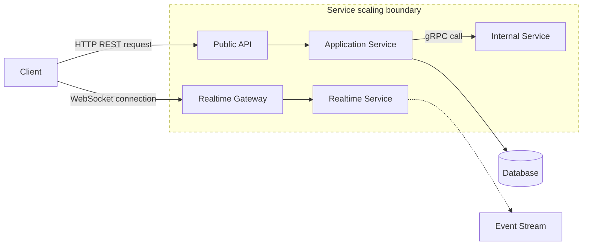

# HTTP, REST, WebSockets, and gRPC

**HTTP, REST, WebSockets, and gRPC are communication approaches that let clients and services exchange requests, responses, streams, or real-time messages across a network.**

## Summary

Modern systems rarely use one communication style everywhere. HTTP provides the general web protocol foundation. REST is an API design style commonly built on HTTP resources and verbs. WebSockets provide long-lived, bidirectional communication for real-time experiences. gRPC provides efficient, strongly typed remote procedure calls, often used for internal service-to-service communication.

Choosing between them is a system design decision, not a syntax preference. The right choice depends on latency needs, client support, payload size, streaming requirements, schema discipline, observability, and operational maturity.

Diagram legend used in this repository:
- Solid arrow: synchronous request/response
- Dashed arrow: asynchronous / eventual flow
- Cylinder shape: stateful storage
- Dotted boundary box: failure domain or scaling boundary

### Real-World Examples

GitHub and Stripe expose public REST APIs for broad client compatibility. Slack and Discord use real-time connections for messaging and presence. Many large microservice platforms use gRPC internally because typed contracts and efficient binary encoding help at service-to-service scale.

## Why It Matters

Communication protocols shape how a system performs, scales, fails, and evolves. A public mobile API optimized for broad compatibility has different needs from an internal high-throughput service call. A chat system needs server-pushed events, while a checkout API usually needs a clear synchronous request and response.

In interviews, protocol choice is often a signal of maturity. Saying "use REST" is not enough. A strong answer explains why REST fits public resource APIs, why WebSockets fit real-time bidirectional updates, why gRPC fits internal typed service calls, and where each option becomes operationally awkward.

These choices also affect versioning, load balancing, retries, caching, debugging, browser support, schema evolution, and security controls. The protocol is part of the architecture, not just an implementation detail.

## How It Works

HTTP is a request-response protocol. A client sends a request containing a method, path, headers, and optional body. The server returns a status code, headers, and optional response body. HTTP works well with proxies, CDNs, browsers, logs, caches, and standard tooling.

REST is an architectural style that models operations around resources. For example, `GET /users/42`, `POST /orders`, and `DELETE /sessions/current` describe actions through resource paths and HTTP methods. REST is popular for public APIs because it is simple, debuggable, and widely supported.

WebSockets begin as an HTTP upgrade, then become a persistent bidirectional connection. After the connection is established, both client and server can send messages. This is useful for chat, collaborative editing, multiplayer state, live dashboards, notifications, and presence. The cost is operational complexity: connection state, fanout, load balancing, heartbeat handling, and reconnect behavior matter.

gRPC uses service definitions, commonly written in Protocol Buffers, to define typed methods and messages. It supports unary calls, server streaming, client streaming, and bidirectional streaming. gRPC is efficient and contract-driven, but browser support and human debugging are less straightforward than plain HTTP/JSON REST.

A practical architecture may expose REST to external clients, use WebSockets for real-time updates, and use gRPC between internal services.

## Trade-Offs

| Choice A | Choice B |
| --- | --- |
| REST is simple, human-readable, cache-friendly, and widely supported. | gRPC is more efficient and strongly typed, but requires schema tooling and is less convenient for casual debugging. |
| HTTP request-response is easy to operate and scale statelessly. | WebSockets enable real-time bidirectional updates but require long-lived connection management. |
| JSON payloads are flexible and easy to inspect. | Protocol Buffers are compact and schema-driven but less readable without tooling. |
| Public APIs benefit from broad HTTP compatibility. | Internal service APIs may benefit more from strict contracts and lower overhead. |
| Polling is easy to implement with HTTP. | Push-based updates reduce delay and waste but add connection and delivery complexity. |

## Failure Modes

### Client-Side

- Clients may retry non-idempotent requests and create duplicate writes.
- WebSocket clients may fail to reconnect cleanly after network changes.
- Mobile clients may hold stale API assumptions across app versions.
- Clients may ignore status codes or error bodies and handle failures incorrectly.

### Network

- High latency can make synchronous APIs feel slow even when servers are healthy.
- Proxies or firewalls may interrupt long-lived WebSocket connections.
- TLS misconfiguration can block all protocol variants.
- Packet loss can degrade streaming and increase retry volume.

### Server-Side

- REST endpoints can become inconsistent if resource boundaries are poorly designed.
- WebSocket gateways can run out of connection capacity or memory.
- gRPC services can fail if client and server schema versions drift unsafely.
- Missing timeouts can cause cascading failures across service calls.

### Data Layer

- Slow database reads can dominate API latency regardless of protocol.
- Repeated polling can overload storage when caching is absent.
- Real-time systems may publish events before durable state is committed.
- Streaming consumers may observe stale or out-of-order data if ordering is not designed explicitly.

## Interview Notes

Use protocol choice to match the access pattern. REST is a safe default for public CRUD-like APIs. WebSockets are appropriate when clients need low-latency server push or bidirectional interaction. gRPC is strong for internal service-to-service calls with clear schemas, performance needs, and controlled clients.

Mention operational details: timeouts, retries, idempotency, schema versioning, authentication, load balancing, connection draining, and observability. For WebSockets, discuss heartbeats and reconnects. For gRPC, discuss service definitions and backward-compatible message evolution.

Interviewer question: "Why not use WebSockets for every API?"
Model answer: WebSockets help real-time flows, but normal request-response APIs are easier to cache, debug, scale statelessly, secure through standard gateways, and operate with standard HTTP tooling.

Interviewer question: "When would you choose gRPC over REST?"
Model answer: Choose gRPC for internal service calls when typed contracts, lower serialization overhead, streaming support, and controlled client generation are more important than browser-native simplicity.

## Related Topics

- [Client-Server Architecture](../fundamentals/client-server-architecture.md)
- [System Design Toolkit README](../../README.md)
