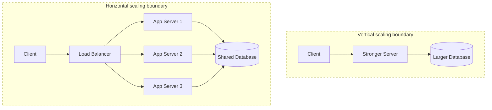

# Vertical vs Horizontal Scaling

**Vertical scaling adds more power to an existing machine, while horizontal scaling adds more machines to share the workload.**

## Summary

Scaling is the process of increasing a system's ability to handle more traffic, data, or work. Vertical scaling, also called scaling up, improves capacity by giving an existing server more CPU, memory, disk, or network resources. Horizontal scaling, also called scaling out, improves capacity by adding more servers and distributing work across them.

Both approaches are useful. Vertical scaling is often simpler because the application may not need major architectural changes. Horizontal scaling is usually better for long-term growth and high availability, but it requires load balancing, stateless services, partitioning, coordination, and more operational discipline.

Diagram legend used in this repository:
- Solid arrow: synchronous request/response
- Dashed arrow: asynchronous / eventual flow
- Cylinder shape: stateful storage
- Dotted boundary box: failure domain or scaling boundary

### Real-World Examples

Early-stage applications often scale vertically by moving to larger cloud instances. Web platforms such as Shopify, GitHub, and Reddit use horizontal scaling across application fleets for high traffic. Distributed databases such as Cassandra and DynamoDB-style systems scale horizontally by partitioning data across nodes.

## Why It Matters

Scaling choices shape cost, availability, operational complexity, and future architecture. A small system may run comfortably on one larger machine, and that can be the correct choice because it keeps the design simple. As traffic grows, one machine eventually hits practical limits: CPU, memory, disk throughput, network bandwidth, or maintenance risk.

Horizontal scaling helps systems handle more users and survive machine failures. If one application server fails, a load balancer can route traffic to the remaining servers. If traffic increases, more servers can be added. This is why many production web systems prefer stateless application servers behind a load balancer.

The difficult part is state. Compute is easier to scale horizontally than data. If each server stores local sessions or local-only files, requests must return to the same server or data becomes unavailable. Databases, caches, queues, and search indexes need their own scaling strategies such as replication, sharding, partitioning, or read replicas.

## How It Works

Vertical scaling increases the resources available to a single node. In cloud environments, this may mean changing from a small instance to a larger instance. For databases, it may mean more memory for caching, faster disks, higher IOPS, or more CPU for query execution. The application architecture may remain mostly unchanged.

Horizontal scaling adds nodes. For stateless application services, this usually means putting multiple servers behind a load balancer. Each server can handle any request because durable state lives outside the server in shared storage, caches, databases, or queues. Autoscaling policies may add or remove servers based on CPU, latency, queue depth, or request rate.

For stateful systems, horizontal scaling is harder. Data may need to be partitioned by key, replicated for availability, or routed to the correct shard. Writes may need coordination. Reads may need consistency rules. Operational tasks such as rebalancing, failover, backups, and schema changes become more important.

A practical design often uses both strategies. Scale vertically first when simplicity matters and limits are not close. Scale horizontally when traffic, availability, or fault isolation requirements outgrow a single machine.

## Trade-Offs

| Choice A | Choice B |
| --- | --- |
| Vertical scaling is simpler and often requires fewer code changes. | Horizontal scaling supports larger growth and better fault tolerance. |
| A larger single machine can improve performance quickly. | Multiple machines reduce dependence on one server but add coordination complexity. |
| Vertical scaling has a hard ceiling based on available hardware. | Horizontal scaling can keep adding nodes, but only if the architecture supports distribution. |
| Stateful local design is easier on one machine. | Stateless service design is easier to load balance and replace. |
| Vertical scaling may reduce operational moving parts. | Horizontal scaling improves availability but requires monitoring, deployment safety, and load balancing. |

## Failure Modes

### Client-Side

- Clients may retry during scaling events and amplify load on the remaining servers.
- Sticky sessions can break user experience if the chosen backend is removed.
- Clients may observe inconsistent behavior if requests hit different server versions during rollout.
- Long-lived connections may need draining before servers are resized or removed.

### Network

- Load balancer misconfiguration can send traffic unevenly across horizontally scaled nodes.
- DNS or routing delays can keep clients pointed at old endpoints after migration.
- Cross-zone or cross-region traffic can add latency when nodes are distributed.
- Network bandwidth can become the real bottleneck even after adding CPU or memory.

### Server-Side

- A vertically scaled server remains a large single point of failure if no replica exists.
- Horizontal fleets can fail under shared dependency pressure, such as one overloaded database.
- Autoscaling may react too slowly to sudden traffic spikes.
- Poor health checks can keep unhealthy servers in rotation.

### Data Layer

- A single database can become the bottleneck after application servers scale out.
- Local disk state can be lost when instances are replaced.
- Sharding can create hot partitions if keys are unevenly distributed.
- Replica lag can cause inconsistent reads after scaling the read path.

## Interview Notes

Start by asking what needs to scale: requests, writes, reads, storage, background jobs, or geographic reach. Then choose the simplest scaling approach that satisfies the requirement. For early scale, vertical scaling may be enough. For high availability or large traffic, horizontal scaling is usually required.

Make the state boundary explicit. Stateless application servers are straightforward to scale horizontally. Stateful databases and caches need separate strategies such as read replicas, partitioning, replication, or consistent hashing. Always mention load balancing, health checks, autoscaling signals, and what happens during deployment or node failure.

Interviewer question: "Why not always scale vertically first?"
Model answer: Vertical scaling is simple, but it has hardware limits and can leave a large single point of failure, so high-traffic or high-availability systems usually need horizontal scaling.

Interviewer question: "What must be true for application servers to scale horizontally?"
Model answer: Any server should be able to handle any request, with durable session and business state stored outside the local process or routed deliberately.

## Related Topics

- [Client-Server Architecture](../fundamentals/client-server-architecture.md)
- [Latency, Throughput, Availability, and Durability](../fundamentals/latency-throughput-availability-durability.md)
- [DNS, CDNs, Proxies, and Load Balancers](../networking/dns-cdns-proxies-load-balancers.md)
- [System Design Toolkit README](../../README.md)
